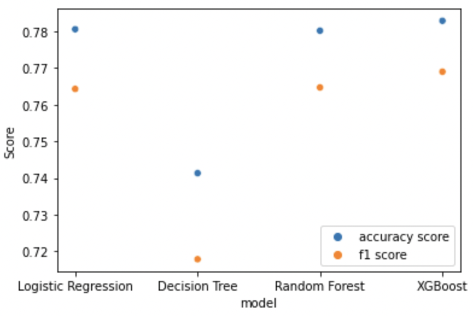
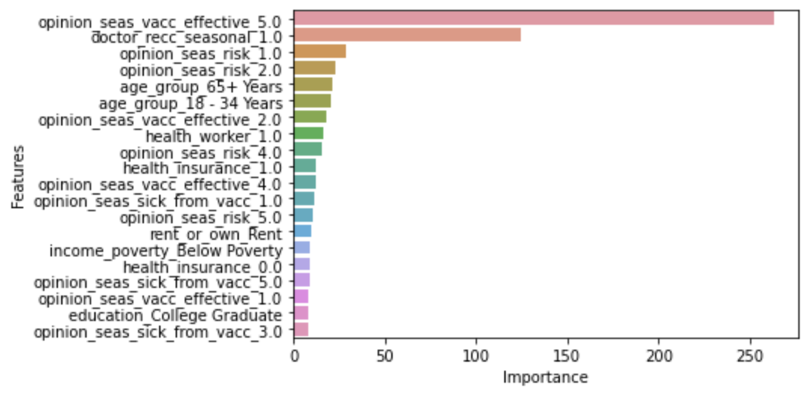
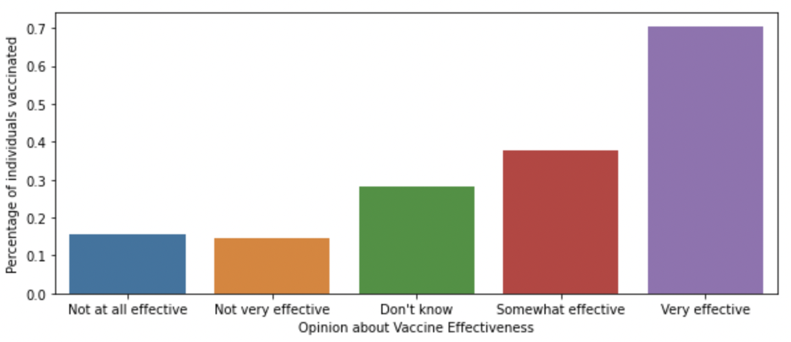
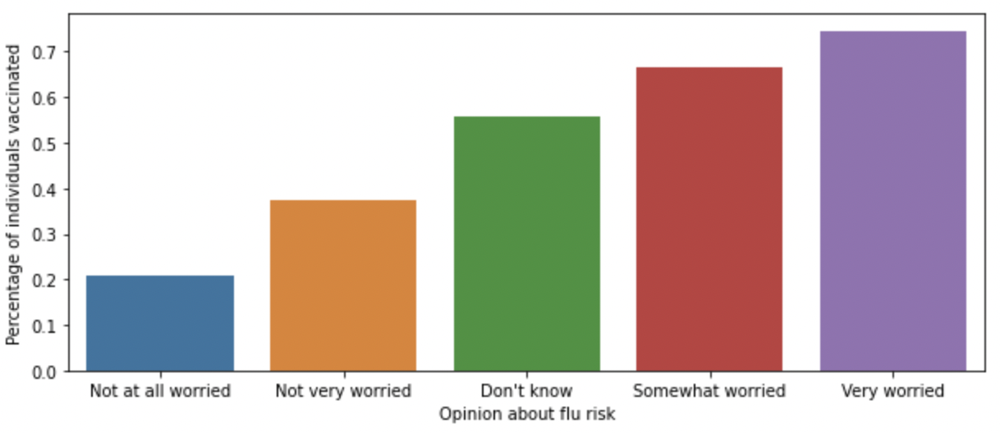
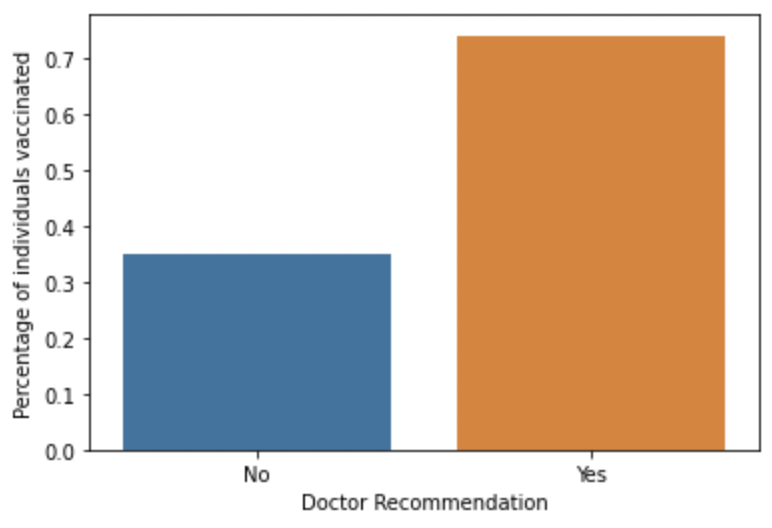
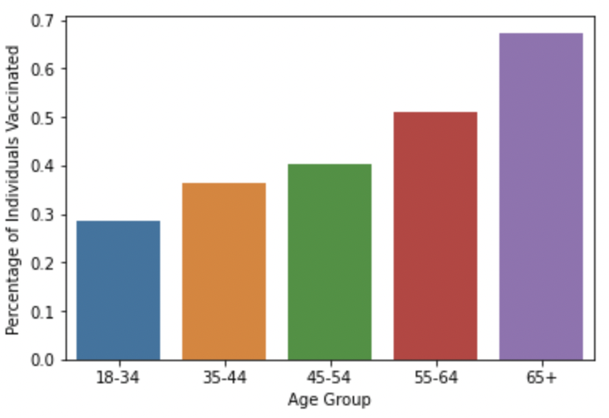

# Predicting Seasonal Flu Vaccines

# Introduction

**Author**: Amelia Dobronyi  
**Pace**: Flex  
**Instructor**: Abhineet Kulkarni  

## Overview

This presentation presents classification models and validation scores for predicting seasonal flu vaccinations based on demographic data. It also presents which demographic factors are most relevant for making those predictions.

## Business Objective

Maximize seasonal flu vaccination rates. To do so, build a classification model that maximizes predictive accuracy and see what factors it suggests are most relevant in doing so.

## Data

Approximately 26,000 instances of individual data and vaccine decision information.

## Overview of classification models and results

After building and evaluating four classification models, the XGBoost was selected on the basis of overall accuracy.

## Important Factors

Import factors for classification that the model isolated are: opinion about vaccine effectiveness, doctor recommendation for vaccination, and age group.

### Opinion about Vaccine Effectiveness and Flu Risk

Individuals who had a higher oppinion of vaccine effectiveness and risks about getting the flu had a higher vaccination rate.

### Doctor Recommendation

Individuals who were recommended by their doctors to get the vaccine were more likely to get vaccinated.

### Age Group

Individuals in progressively higher age groups were more likely to get vaccinated.

## Conclusion 

To increase vaccination rates, public health officials should:
- more broadly advertise the effectiveness of flu vaccines and the risks posed if one does not get vaccinated
- encourage doctors to suggest the vaccination to patients
- target lower age groups (specifically below 45 years) to encourage vaccination

## Repository structure

- technical notebook: student_v1.ipynb
- figures folder
- data set: training_set_features.csv, labels.csv, data.csv
- README.md
- presentation.pdf
